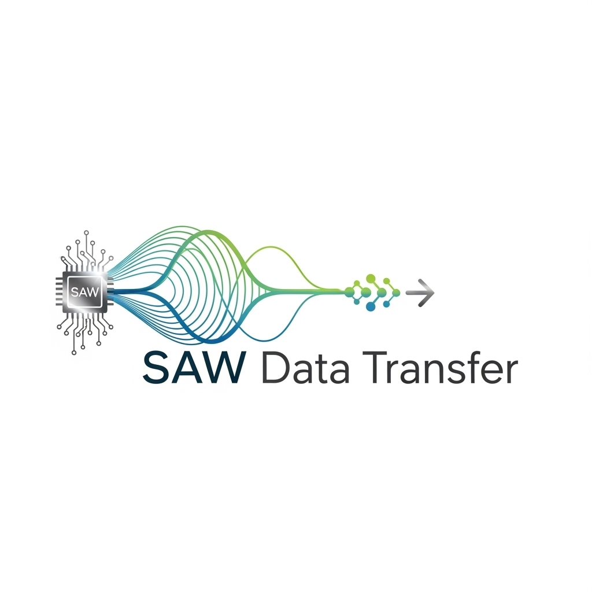

# Surface Acoustic Wave Data Transfer



## Overview

The **Surface Acoustic Wave Data Transfer System** is an innovative approach to secure, offline, and high-speed data transmission. By utilizing ultrasonic Surface Acoustic Waves (SAWs), this system enables direct point-to-point communication without relying on conventional wireless or wired networks. It's designed to be environmentally friendly, non-interfering, and safe for both humans and animals.

-----

## Key Features

  - **Offline & Air-Gapped Operation**: Functions independently of the internet and cellular networks.
  - **High-Speed Data Transfer**: Adjustable pitch modulation allows for variable data transfer rates.
  - **Secure Communication**: Employs pseudo-randomized encoding to ensure data integrity and prevent interception.
  - **Environmentally Safe**: Non-electromagnetic and non-ionizing, posing no harm to living organisms or existing technologies.
  - **Multi-Format Support**: Capable of transmitting various file types, including documents, images, and videos.

-----

## System Architecture

The system operates through a multi-stage process:

1.  **Digital Data Encoding**: Converts binary data into a suitable format for mechanical transmission.
2.  **Mechanical Wave Generation**: Utilizes piezoelectric substrates and Interdigital Transducers (IDTs) to generate SAWs.
3.  **Wave Propagation**: Transmits the mechanical waves through the medium.
4.  **Wave Reception**: Captures the propagated waves using a receiving IDT.
5.  **Signal Decoding**: Converts the received mechanical waves back into digital data.

*Note: For a detailed technical breakdown, refer to the `docs/Idea.md` file.*

-----

## Applications

  - **Secure Local Data Transfer**: Ideal for environments where data security is paramount.
  - **Covert Communication Channels**: Suitable for military, intelligence, or corporate applications requiring discreet communication.
  - **Medical Equipment Integration**: Facilitates data transfer in medical settings, such as MRI systems, without interference.
  - **Neuroengineering**: Potential applications in brain-computer interfaces and assistive technologies for conditions like Motor Neuron Disease (MND).
  - **High-Density Environments**: Enables data transfer in areas with congested wireless networks.

-----

## Development Environment

### Programming Languages

  - **Python**: Used for prototyping and simulation of the data transfer process.
  - **C++**: Implemented for the actual data transfer system to ensure performance and efficiency.

### Dependencies

  - **GLFW**: A library for creating windows with OpenGL contexts and managing input.
  - **Dear ImGui**: A bloat-free graphical user interface library for C++.
  - **ImPlot**: A plotting library for creating interactive plots within ImGui.

*Note: For a comprehensive list of dependencies and installation instructions, refer to the `Scripts/` directory.*

-----

## Project Structure

```
SurfaceAcousticWaveDT/
├── Scripts/ # Build scripts and setup utilities
├── docs/ # Documentation files
│ └── Idea.md # Detailed technical concept
├── proto/ # Prototype implementations
│ └── src/ # Source code for prototypes
├── simulations/ # Simulation models and results
├── src/ # Main source code for the system
├── vendor/ # External libraries and dependencies
├── .gitignore # Git ignore file
├── CMakeLists.txt # Build configuration file
└── LICENSE # Project license
```

-----

## Getting Started

To begin working with the project:

1.  Clone the repository:

    ```bash
    git clone https://github.com/NorthernL1ghts/SurfaceAcousticWaveDT.git
    cd SurfaceAcousticWaveDT
    ```

2.  Install necessary dependencies:

    For Python:

    ```bash
    pip install -r requirements.txt
    ```

    For C++:

    Follow the instructions in the `Scripts/` directory to set up the C++ environment and build the project.

3.  Run simulations or prototypes as needed.

-----

## Contributing

Contributions are welcome\! Please fork the repository, create a new branch, and submit a pull request with your proposed changes.

-----

## License

This project is licensed under the MIT License - see the `LICENSE` file for details.

-----

## Acknowledgements

  - **GLFW**: [https://www.glfw.org/](https://www.glfw.org/)
  - **Dear ImGui**: [https://github.com/ocornut/imgui](https://github.com/ocornut/imgui)
  - **ImPlot**: [https://github.com/epezent/implot](https://github.com/epezent/implot)
  - **PyImgui**: [https://github.com/pyimgui/pyimgui](https://github.com/pyimgui/pyimgui)

-----